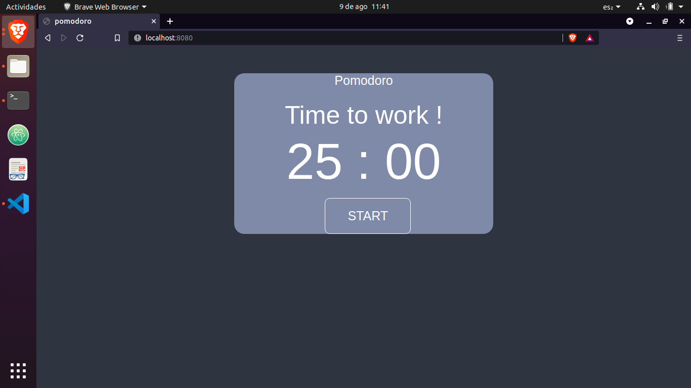
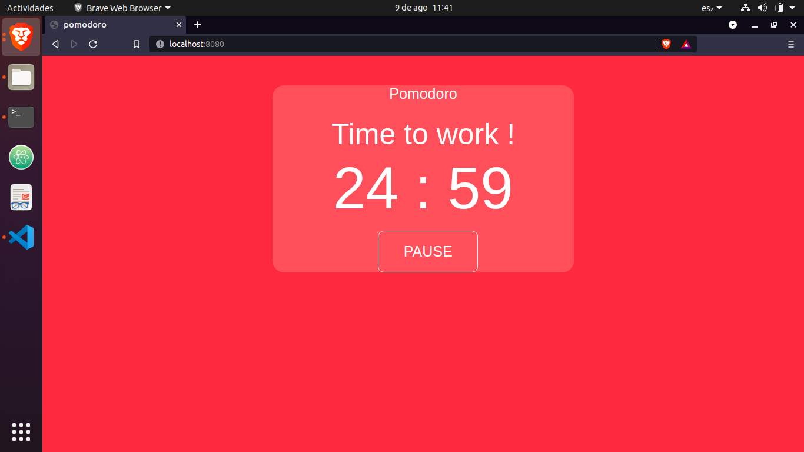

# pomodoro

## Project setup
```
npm install
```

### Compiles and hot-reloads for development
```
npm run serve
```

### Compiles and minifies for production
```
npm run build
```

### Lints and fixes files
```
npm run lint
```

### Customize configuration
See [Configuration Reference](https://cli.vuejs.org/config/).


## Description

This is a minimalist application to use the pomodoro technique, which consists of 4 blocks each with 25 minutes of work and 5 minutes of rest. Once you have completed the 4 blocks you can take 30 minutes of rest. 

## Pause page


## Work page


## Short Rest page
